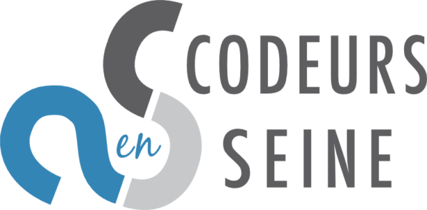
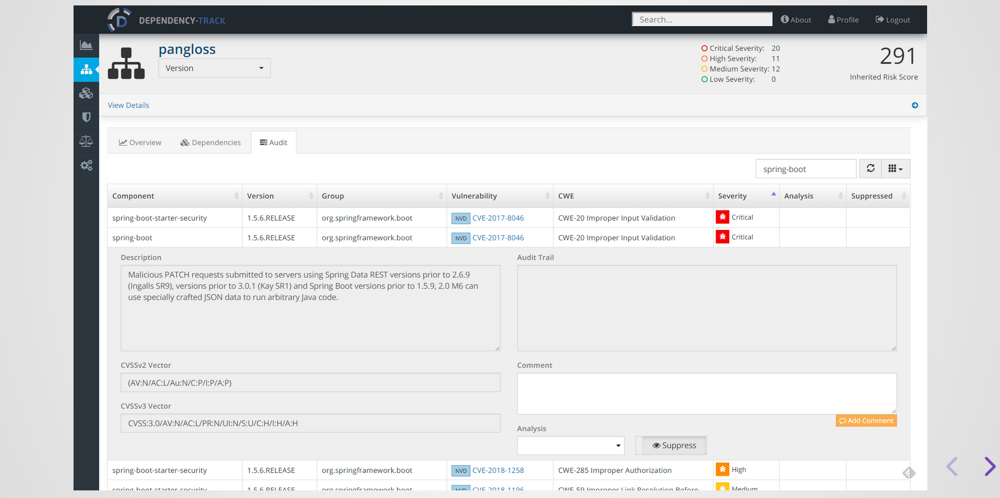

# Titre

## Cartouche d'identification

 - Manifestation : CodeursEnSeine 2019
 - Lieu : Kindarena
 - Conférence : Comment se faire hacker bien comme li faut !
 - Horaire de la conférence : 11h - 12h
 - Durée de la conférence : 1 heure
 - Conférencier(s) :
   - Julien Topçu : https://www.linkedin.com/in/julien-top%C3%A7u/?originalSubdomain=fr
 - Audience : 300 personnes
 - Auteur du billet : Gauthier WIEMANN
 - Mots-clés : sécurité, OWASP, risque, conférence
 - URL de l'illustration : 
   - quelques sources : https://www.owasp.org/images/7/72/OWASP_Top_10-2017_%28en%29.pdf.pdf

## Support
 - Lien vers le support (diapos) présenté en conférence : https://slides.com/julientopcu/comment-se-faire-hacker-bien-comme-il-faut/fullscreen#/
 - Lien vers le film de la présentation : https://www.youtube.com/watch?v=t9UxH8zC95A
 - Nombre de diapos du support : 17
 - Plan du support :
     - Introduction
     - Les 10 failles de sécurité répertoriée par OWASP
     - Sources et liens intéressants

## Résumé
La conférence était sous forme d’une histoire. Candide crée le site Pangloss permettant d’acheter entre autre des livres. Ce site est codé suivant le principe de l’optimisme et nous avons vu tout le long de la conférence que ce n'est pas forcément la bonne méthode. Tout ceci était un prétexte afin de présenter le top 10 des risques de sécurité les plus critiques des applications web répertoriées par OWASP. On y retrouve pêle-mêle, les injections SQL, les attaques de type XSS ou XEE, le fait de ne pas protéger suffisamment des données sensibles ou bien encore le fait d'utiliser des outils avec des vulnérabilités connues. OWASP est une organisation à but non lucratif ayant pur but d’améliorer la sécurité informatique dans le monde.

Le but de cette conférence était de ce fait de sensibiliser sur les bonnes pratiques de développement en terme de sécurité. En effet, il est facile de créer ou de ne pas combler une faille. Tout le long de la conférence, le conférencier nous a proposé plusieurs moyens de se protéger dont le logiciel OWASP Dependency Track.

## Architecture et facteur qualité
Le sujet de la conférence peut influer sur une part importante de la qualité, c'est à dire la sécurité. Grâce au logiciel OWASP Dependency Track, l'aspect sécurité du code peut être inclu dans l'intégration continue.

